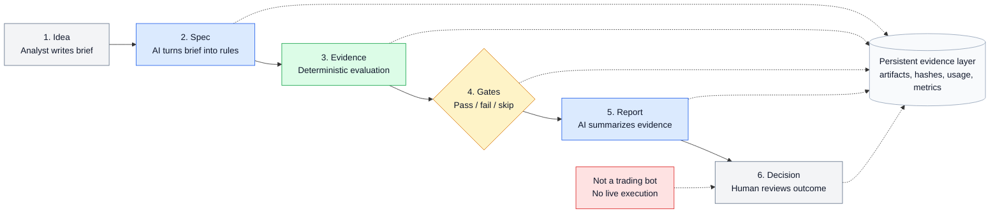

# QuantSpec

QuantSpec is an AI-augmented, spec-driven validation pipeline where one analyst orchestrates LLM-assisted stages to turn trading hypotheses into reproducible specs, automated evidence, quality-gated reports, and documented human decisions.

It is not a trading bot. It does not execute live trades or broker orders. The project is designed to demonstrate AI-augmented development, Spec-Driven Development, quality gates, traceable artifacts, and evidence-based decision workflows.

## Setup

QuantSpec is in early active development. The current release provides project packaging, development checks, and a minimal command-line entry point.

Requirements:

- Python 3.11+
- `uv`

Install and run checks:

```bash
uv sync
uv run pytest -q
uv run ruff check .
uv run ruff format --check .
```

The package exposes a command-line entry point so installation can be validated:

```bash
uv run quantspec --version
```

## Architecture Pipeline



## What This Demonstrates

- AI-augmented development: one analyst coordinates LLM-assisted workflow stages.
- Spec-Driven Development: each hypothesis becomes an explicit specification before evaluation.
- Quality gates: validation criteria are fixed in code and produce PASS, FAIL, or SKIPPED outcomes.
- Reproducibility: fixture mode runs without requiring an API key.
- Traceability: each run produces auditable artifacts from `spec.md` through `decision.md`.
- Evidence discipline: productivity metrics are shown only after measured runs exist.

## MVP Pipeline

1. Write a `Hypothesis Brief` in YAML.
2. Generate a structured strategy specification with a fixture or live LLM client.
3. Run deterministic evaluation with `python_demo_engine`.
4. Evaluate fixed quality gates against IS/OOS metrics and risk constraints.
5. Generate an executive report from verified artifacts.
6. Produce a decision document: `CANDIDATE_FOR_REVIEW` or `CLOSED_BY_GATE`.

## Current Status

The current release provides package metadata, development tooling, an environment template, git hygiene, and smoke tests. Implementation is still pending for the executable MVP: models/schemas, validation metrics, gates, runner, fixture demos, and live Claude integration.

The intended public MVP will be runnable without an API key through fixture mode. Live Claude mode is planned as an opt-in integration.
