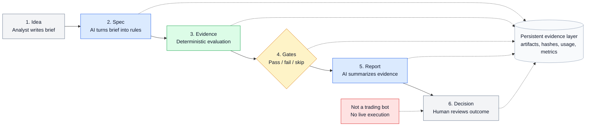

# QuantSpec

QuantSpec is an AI-augmented, spec-driven validation pipeline where one analyst orchestrates LLM-assisted stages to turn trading hypotheses into reproducible specs, automated evidence, quality-gated reports, and documented human decisions.

It is not a trading bot. It does not execute live trades or broker orders. The project is designed to demonstrate AI-augmented development, Spec-Driven Development, quality gates, traceable artifacts, and evidence-based decision workflows.

## Setup

The default workflow is fully reproducible: artifact contracts, deterministic validation metrics, fixed quality gates, synthetic demo fixtures, fixture LLM responses, a deterministic demo engine, and CLI commands that produce auditable hypothesis artifacts without an API key.

Requirements:

- Python 3.11+
- `uv`

Install and run checks:

```bash
uv sync
uv run pytest -q
uv run ruff check .
uv run ruff format --check .
```

The package exposes a command-line entry point so installation can be validated:

```bash
uv run quantspec --version
```

Run the offline demos:

```bash
uv run quantspec run examples/HYP-001-intraday-fail-demo.yaml --llm-mode fixture
uv run quantspec run examples/HYP-002-intraday-pass-demo.yaml --llm-mode fixture
```

The first demo closes by gate outcome and exits with code `2`. The second demo exits with code `0` and produces a candidate review decision.

Optional live Claude mode is available for the LLM-backed `spec` and `report` stages. It is opt-in and never required for normal tests or fixture demos:

```bash
export ANTHROPIC_API_KEY=your_api_key_here
export QUANTSPEC_CLAUDE_MODEL=claude-sonnet-4-5-20250929

uv run quantspec spec HYP-001-intraday-fail-demo --llm-mode live
uv run quantspec report HYP-001-intraday-fail-demo --llm-mode live
```

Live mode writes raw model responses and usage metadata under `hypotheses/<hypothesis-id>/_raw/`, including `spec_response.json`, `report_response.json`, and `usage.json`. Do not commit generated artifacts or secrets.

## Architecture Pipeline



## What This Demonstrates

- AI-augmented development: one analyst coordinates LLM-assisted workflow stages.
- Spec-Driven Development: each hypothesis becomes an explicit specification before evaluation.
- Quality gates: validation criteria are fixed in code and produce PASS, FAIL, or SKIPPED outcomes.
- Reproducibility: fixture mode is the default and runs without requiring an API key.
- Live LLM integration: Claude can be used explicitly for spec and report generation when credentials are present.
- Traceability: each run produces auditable artifacts from `spec.md` through `decision.md`.
- Evidence discipline: productivity metrics are shown only after measured runs exist.

## MVP Pipeline

1. Write a `Hypothesis Brief` in YAML.
2. Generate a structured strategy specification with a fixture or live LLM client.
3. Run deterministic evaluation with `python_demo_engine`.
4. Evaluate fixed quality gates against IS/OOS metrics and risk constraints.
5. Generate an executive report from verified artifacts.
6. Produce a decision document: `CANDIDATE_FOR_REVIEW` or `CLOSED_BY_GATE`.

## Offline Demo Outputs

Each run writes artifacts to `hypotheses/<hypothesis-id>/`:

- `brief.yaml`
- `spec.md`
- `results.json`
- `gates.json`
- `report.md`
- `decision.md`

Fixture mode is the default verification path and does not require external services. Live mode is available only when selected with `--llm-mode live` and configured with `ANTHROPIC_API_KEY`.
